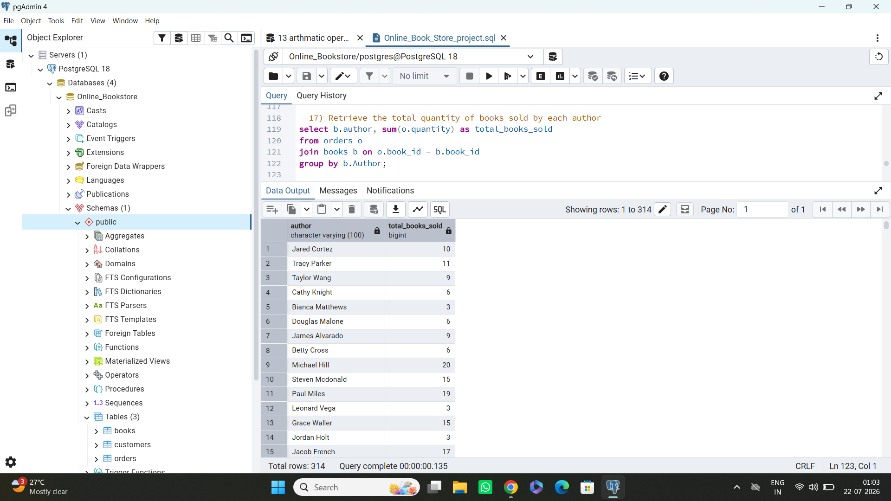
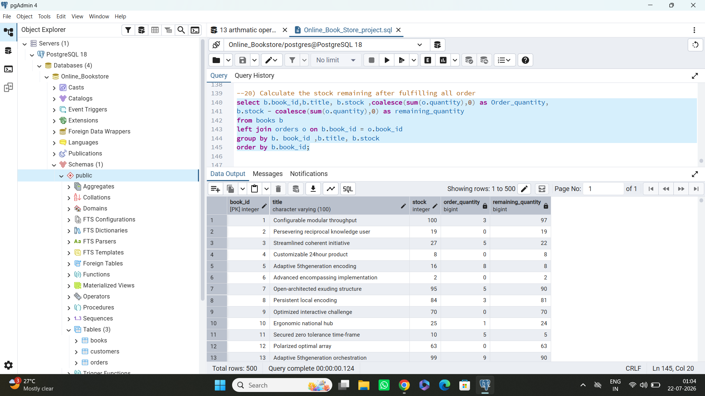

# Online Book Store Database Analysis using PostgreSQL

## Project Overview

The **Online Book Store Database Analysis** project is built using **PostgreSQL** to demonstrate practical SQL skills through a relational database. It manages books, customers, and orders while performing business-oriented data analysis using SQL queries.

This project showcases essential SQL concepts commonly used in Data Analyst and Database roles.

---

##  Technologies Used

* PostgreSQL
* SQL
* pgAdmin

---

##  Database Schema

The project consists of three tables:

###  Books

* Book ID
* Title
* Author
* Genre
* Published Year
* Price
* Stock

###  Customers

* Customer ID
* Name
* Email
* Phone
* City
* Country

###  Orders

* Order ID
* Customer ID
* Book ID
* Order Date
* Quantity
* Total Amount

---

##  SQL Concepts Covered

* SELECT
* WHERE
* ORDER BY
* LIMIT
* Aggregate Functions (`SUM`, `AVG`, `COUNT`, `MAX`, `MIN`)
* GROUP BY
* HAVING
* INNER JOIN
* LEFT JOIN
* COALESCE
* DISTINCT
* Data Analysis Queries

---

##  Project Features

* Manage books, customers, and orders
* Analyze customer purchasing behavior
* Identify top-selling books
* Find highest spending customers
* Calculate total sales by genre
* Perform inventory analysis
* Generate business insights using SQL

---

##  Sample Business Questions Solved

* Retrieve all books in a specific genre.
* Find books published after a given year.
* List customers from a specific country.
* Display orders placed within a date range.
* Calculate total stock available.
* Find the most expensive book.
* Calculate total books sold by genre.
* Find customers who spent the most.
* Identify cities with customers spending over a specific amount.
* Find books that have never been ordered.

---

##  Project Structure

```text
Online-Book-Store-PostgreSQL/
│
├── Online_Book_Store_project.sql
├── README.md
├── Dataset/
│   ├── books.csv
│   ├── customers.csv
│   └── orders.csv
│
└── Screenshots/
    ├── 11_Query.png
    ├── 12_Query.png
    ├── 13_Query.png
    ├── 14_Query.png
    ├── 15_Query.png
    ├── 16_Query.png
    ├── 17_Query.png
    ├── 18_Query.png
    ├── 19_Query.png
    └── 20_Last.png
```

---

##  How to Run

1. Open **pgAdmin**.
2. Create a PostgreSQL database.
3. Open `Online_Book_Store_project.sql`.
4. Execute the SQL script.
5. Run the analysis queries to explore the database.

---

##  Screenshots






##  Learning Outcomes

Through this project, I gained hands-on experience with:

* Relational Database Design
* SQL Query Writing
* Data Retrieval
* Business Data Analysis
* PostgreSQL
* Query Optimization Basics

---

##  Author

**Manik Chand**

**B.Tech – Computer Science & Engineering (Artificial Intelligence)**

**Aspiring Data Analyst**

---

##  If you found this project useful, consider giving it a star!
